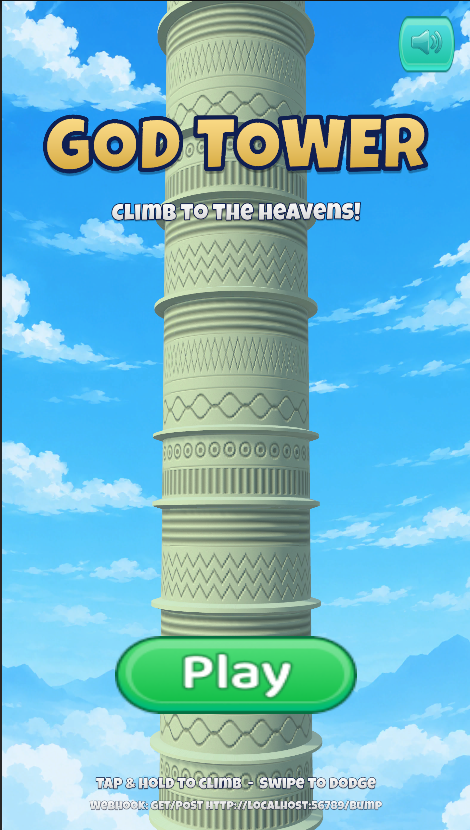
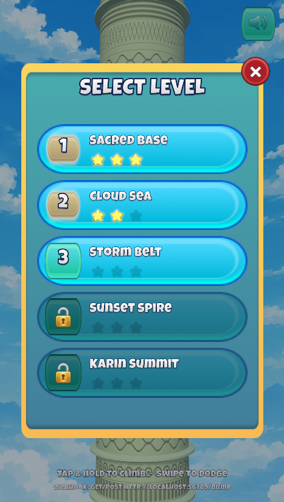
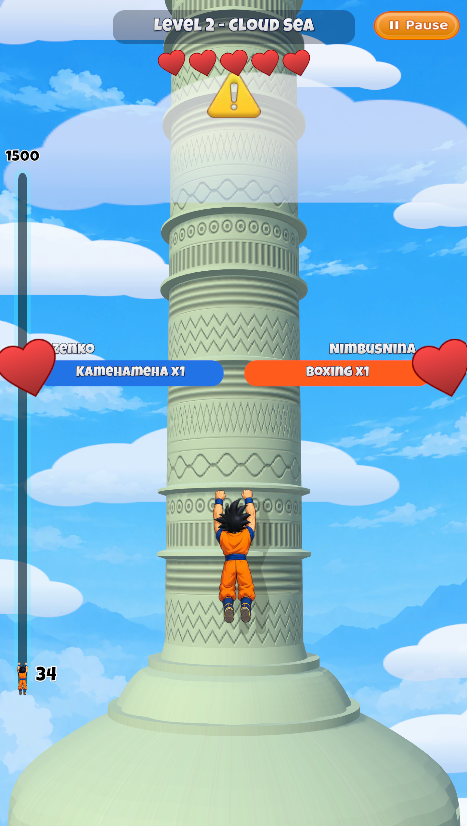
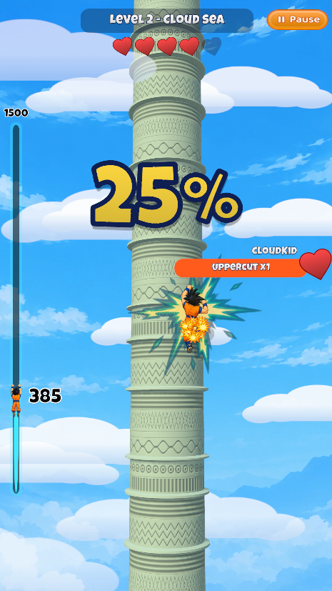
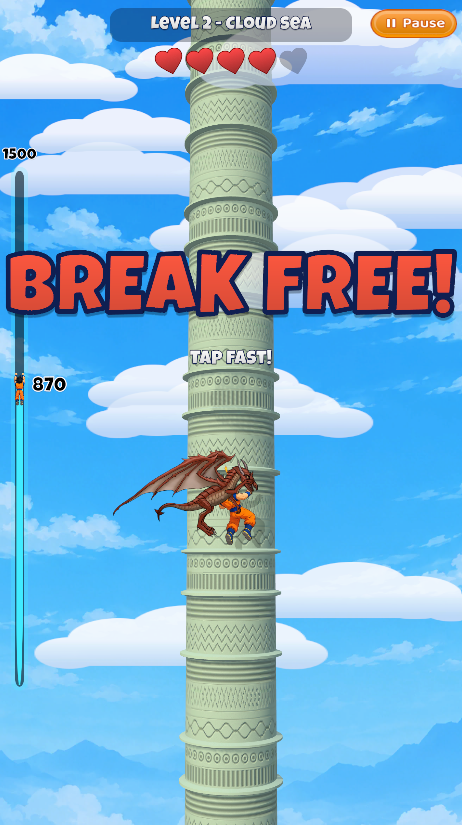

# God Tower — Unity Technical Test

A reproduction of the reference climbing game *God Tower* (Karin Tower style): a hero climbs an
endless carved tower while "live-stream gifts" throw gloves, race cars, dragons and ghosts at them.
Five playable levels, a local HTTP webhook that triggers a full-screen boxing-glove barrage, and an
Android build target.

| Deliverable | Link |
|---|---|
| Android APK | https://www.transfernow.net/dl/20260929hhjXu6gv|
| Gameplay video |https://youtube.com/shorts/zNdy_3eXKxU?feature=share |
| Source (this repository) | https://github.com/UsamaAbid94/GodTowerGame |

---

## Screenshots

<table>
  <tr>
    <td align="center"><br><b>Main menu</b></td>
    <td align="center"><br><b>Level selection</b></td>
    <td align="center"><br><b>Gameplay</b></td>
  </tr>
  <tr>
    <td align="center"><br><b>Gameplay</b></td>
    <td align="center"><br><b>Gameplay</b></td>
    <td></td>
  </tr>
</table>

### Gameplay video

[▶ Watch the gameplay video](Assets/Screenshots/gameplay-video.mp4) (or on [YouTube](https://youtube.com/shorts/zNdy_3eXKxU?feature=share))

---

## 1. Engine & packages

| | Version |
|---|---|
| **Unity Editor** | **6000.4.0f1** (Unity 6.4) |
| Render pipeline | Universal RP 17.4.0, Universal (forward) renderer: 3D, real-time lighting, soft shadows, fog |
| Input | Input System 1.19.0 (new input system only) |
| UI / text | uGUI 2.0.0 + TextMeshPro |
| Rigged monsters | 2D Animation 14.0.3, 2D PSD Importer 13.0.2 |
| Target | Android (IL2CPP, ARM64, portrait) |

---

## 2. Opening, building and playing

1. Open the project folder in Unity **6000.4.0f1**.
2. Run **God Tower ▸ Build Project** (menu bar). This is a one-click, repeatable setup that
   (re)generates everything from code (`Assets/_Game/Editor/ProjectBuilder.cs`):
   the procedural art, sprite pivots, climber animations, the 5 level configs, hazard/monster data,
   prefabs, the `MainMenu` and `Game` scenes, build settings and Android player settings.
   On a fresh checkout the first run imports TextMeshPro's essential resources, then re-runs itself.
3. Press **Play** in `Assets/_Game/Scenes/MainMenu.unity`, or build the APK via
   **File ▸ Build Profiles ▸ Android ▸ Build** (scenes are already registered).

### Controls
| Action | Touch | Keyboard (editor) |
|---|---|---|
| Climb | Tap or **hold** anywhere; **tap fast** to build momentum | Space / W / ↑ (tap repeatedly for momentum) |
| Change lane (dodge) | **Swipe** left / right | A / D / ← / → |
| Break free from a monster | Tap fast | Space (mash) |
| Pause | Pause button | Esc |
| Trigger bump (editor & development builds only) | — | B |

---

## 3. Webhook — `GET/POST http://localhost:56789/bump`

### What happens
While a level is being played, any `GET` or `POST` to `/bump` triggers the full-screen event:
a boxing bell, a slammed **BUMP!** title, **8 boxing gloves** punching the climber from all
directions (impact bursts, white flashes, sparks, red tint, screen shake, zoom punches, a cartoon
brawl cloud), then a giant uppercut finisher with **WHAM!** that knocks the climber 250 m down the
tower. Play then continues normally. Requests that arrive during a barrage are queued (up to 3).

### Triggering it

**In the Editor** (Play mode, inside a level):
```bash
curl -X POST http://localhost:56789/bump
# or
curl http://localhost:56789/bump
```

**On an Android device or emulator, from the PC.** The HTTP server runs *on the phone*, so the PC's
`localhost:56789` has to be forwarded **to** the device. That is `adb forward`
(`adb reverse` is the opposite direction, device → PC, and is **not** what's needed here):
```bash
adb forward tcp:56789 tcp:56789
curl -X POST http://localhost:56789/bump
```
The same command works for the Android emulator. Remove the forward with `adb forward --remove tcp:56789`.

Alternatives: the listener binds all interfaces, so on the same Wi-Fi you can call
`curl -X POST http://<phone-ip>:56789/bump`, or open `http://localhost:56789/bump` in a browser on
the phone itself.

### Responses
| Status | Body | When |
|---|---|---|
| `200 OK` | `{"ok":true,"event":"bump"}` | Accepted; the barrage plays |
| `409 Conflict` | `{"ok":false,"error":"no level is being played"}` | Main menu, countdown, paused, or level finished |
| `404 Not Found` | `{"ok":false,"error":"unknown path, use /bump"}` | Any other path |
| `405 Method Not Allowed` | `{"ok":false,"error":"use GET or POST"}` | Other methods |
| `204 No Content` | — | CORS pre-flight (`OPTIONS`) |

### Implementation (`Assets/_Game/Scripts/Webhook/`)
- **`BumpServer`**: a minimal HTTP/1.1 server on a raw `TcpListener` (port 56789), created automatically
  at startup (`RuntimeInitializeOnLoadMethod`) and kept across scenes. `TcpListener` was chosen over
  `HttpListener` because it behaves identically in the Editor and in IL2CPP Android builds and needs no
  URL ACLs.
- **Thread safety**: sockets are served on a background thread, which only parses the request and
  increments a counter with `Interlocked`. `Update()` drains the counter on Unity's **main thread** and
  raises `BumpReceived`, so no Unity object is touched off the main thread. Header/body sizes and read
  timeouts are bounded, so a bad client can't stall the game.
- **`GloveBarrage`**: plays the event. Its UI objects are created once and pooled, so there are no
  allocations or spikes per bump. The climber is only stunned while the barrage runs, so the game
  can't soft-lock.
- Android needs the INTERNET permission for a socket server, even on localhost. The build forces it
  (`PlayerSettings.Android.forceInternetPermission`).

---

## 4. Levels

Each level is a `LevelConfig` asset (`Assets/_Game/Data/Levels/`). You win by reaching the goal
height and lose by losing all 5 hearts. Winning unlocks the next level; stars depend on hearts kept.

| # | Name | Goal | Theme | New threats |
|---|---|---|---|---|
| 1 | Sacred Base | 1000 m | Bright day, ambient glows | Falling gloves, race car; a ghost ambush |
| 2 | Cloud Sea | 1500 m | Dense clouds, wind trails | + Uppercut from below; **dragon** ambush |
| 3 | Storm Belt | 2500 m | Storm sky, lightning, rain | Ghost + dragon ambushes |
| 4 | Sunset Spire | 3500 m | Sunset tint | Two ghosts at once, then the dragon |
| 5 | Karin Summit | 5000 m | Night sky, lightning, falling stars | **Dragon + ghost together** (450 m drag) |

**Gameplay systems**
- **Live-gift waves** (red banners, as in the reference): warning icons over the threatened lanes, then:
  - **Boxing**: gloves falling down the lanes, with a POW! hit
  - **Uppercut**: a giant glove rising from below
  - **Race Car**: a car diving down a lane trailing fire; the camera zooms out, and a hit gives BOOM!

  At least one lane is always left open.
- **Power-ups** (blue banners):
  - **Super Saiyan**: an aura and electric crackle; the climber rushes up and smashes through hazards
  - **Kamehameha**: a charged energy beam that clears every hazard on screen
- **Monster ambushes** (the reference's "Dragon" gift):
  1. The camera pans up the tower to reveal the monsters circling it.
  2. It glides back down as they dive at the climber.
  3. They grab the climber and drag them down; tapping fast breaks free sooner.
  4. A Super Saiyan rush or a Kamehameha repels them.
- **Momentum**: tapping in rhythm (each tap within 0.4 s of the last) builds momentum, which makes every step up to
  70% taller, puffs bigger grip dust, sparkles and pulls the camera back slightly. Holding climbs at the base rate.
  Momentum fades when the rhythm breaks and is lost on a hit; filling it pops a light burst and an "ON FIRE!" call-out.
- **Near misses**: switching lane and letting a hazard skim past in the neighbouring lane is a dodge: a tiny
  freeze-frame, sparkles, a whoosh and a big momentum top-up.
- **Summit celebration**: reaching the goal lands like a hit (freeze-frame, flash, shockwave, shake, zoom punch), then
  the camera pulls back on sun rays behind the climber and a golden spark rain. Two confetti cannons fire from the
  bottom corners, followed by a firework show of rockets and sky bursts, each with its own confetti. Confetti keeps
  raining behind the result panel, and every star it awards pops another firework and confetti burst.
- **Camera**: follow, a fly-in during the intro countdown, zoom-out while falling or boosting,
  zoom punches on impact, pull-back on victory, and trauma-based screen shake.

---

## 5. Project structure

```
Assets/_Game/
  Scripts/
    Core/        SceneFlow, GameProgress (PlayerPrefs), WorldScale, Ease
    Data/        LevelConfig, LevelDatabase, GameArt, HazardProfile, MonsterProfile (ScriptableObjects)
    Gameplay/    LevelController, ClimberController/Input, CameraRig, TowerBuilder
      Hazards/   HazardSpawner, LaneProjectile
      Powers/    SuperSaiyanFx, KiBlast, PowerUpController
      Boss/      AmbushDirector, MonsterActor
      Environment/ SkyBackground, CloudField
      Vfx/       VfxPool (pooled sprite bursts), ParticleFx (Cartoon FX spawner), DropShadow
    UI/          HUD, banners, pause/result panels, main menu, tweens
    Sound/       GameAudio + SfxSynth (procedural SFX & music)
    Webhook/     BumpServer, GloveBarrage
  Editor/        ProjectBuilder (one-click setup), TowerArt (3D tower meshes/material), RenderSetup (URP + lighting),
                 ArtPipeline, ClimberAnimations, EffectsCatalog, FontBuilder, UiFactory, AssetUtil
  Art/ Animation/ Data/ Prefabs/ Scenes/   (generated or configured by the builder)
```

Design notes:
- **Data-driven.** Levels, hazard types and monsters are ScriptableObjects, so tuning needs no code changes.
- **Reproducible.** The scenes and prefabs are generated from code, which keeps them reviewable and diffable.
- **Low allocation.** Sprite effects, projectiles and warnings are pooled, and gameplay code avoids per-frame allocations.
- **Explicit wiring.** Events connect systems (climber boost/landing, power-up collection, webhook bump)
  instead of `Find` calls or singletons. The only exceptions are the audio service and the webhook server,
  which must outlive scenes.

---

## 6. Third-party assets

All assets are free, from the Unity Asset Store, open-licensed, or AI-generated / procedural, as the
brief allows. No paid assets are used, and no human artist contributed.

| Asset | Author | Used for | License | Source |
|---|---|---|---|---|
| Cartoon FX Remaster Free | Jean Moreno (JMO) | Particle FX: hits, explosions, fire, POW/BOOM/WHAM/WOW texts, auras, ambient rain/stars/wind | Unity Asset Store EULA (Standard Unity Asset Store End User License) | https://assetstore.unity.com/packages/vfx/particles/cartoon-fx-remaster-free-109565 |
| Dungeon Characters 2D | Asset Store publisher | Rigged, animated Dragon and Ghost (monster ambushes) | Unity Asset Store EULA (free) | https://assetstore.unity.com/?q=Dungeon%20Characters%202D |
| Race Cars 2D | Looneybits (looneybits.com) | Race car hazard sprites | Unity Asset Store EULA (free) | https://assetstore.unity.com/?q=Race%20Cars%202D%20looneybits |
| Hyper Casual UI | _publisher_ | Buttons, panels, icons (hearts, stars, lock, sound) | Free UI kit; its bundled font is SIL OFL 1.1 | _add source link_ |
| Luckiest Guy (font) | Astigmatic | All in-game text | Apache License 2.0 (`Assets/_Game/Art/Fonts/LuckiestGuy-LICENSE.txt`) | https://fonts.google.com/specimen/Luckiest+Guy |

**AI-generated / procedural (by the candidate)**
- `Art/Generated/testgamesprites.png`: AI-generated sheet (climber poses, boxing gloves, impact effects),
  background-removed and sliced in Unity.
- `Art/Source/background.png`: AI-generated painted sky.
- The 3D carved tower (meshes, albedo and normal maps) is **generated procedurally** by `TowerArt.cs`;
  clouds and UI shapes are painted by `ArtPipeline.cs`.
- **Audio**: every sound effect and the music loop are **synthesised at runtime** (`SfxSynth.cs`),
  so the project ships no audio files.

---

## 7. Assumptions & deviations

- **Rendering**: the game is **3D rendered** with URP's Universal (forward) renderer and a perspective camera:
  - **Tower**: a real 3D mesh generated in code (lathe-turned column modules with stepped rims, a ribbed
    lotus-dome base and a pointed summit). Its lit stone material has a generated normal map, so the
    engraved bands catch the light.
  - **Lighting**: a directional sun with soft shadows, sky ambient light, and distance fog in each level's
    sky colour, so the upper tower fades into the haze as in the reference.
  - **Depth**: clouds sit at real depths (behind and in front of the tower), and the monsters orbit the
    tower in 3D; the depth buffer hides them as they pass behind it.
  - **Characters**: the climber, hazards and monsters are 2D rigs/sprites placed in the 3D scene, a common
    approach in hyper-casual games. A fully 3D, rigged character that fits the style wasn't available within
    the free/AI-only asset constraint and the 24 h window.
- **Live-stream gifts**: the reference's third-party "TikTikBox" viewer gifts are simulated. Hazard and
  power-up waves are announced by gift banners with placeholder viewer names.
- **Character**: the climber is an AI-generated character in the style shown in the reference video.
  It is used only for this internal evaluation, as the brief states.
- **Balance**: difficulty ramps across the levels but is tuned to be forgiving, so every level is completable.

---

## 8. Known limitations

- Monster scale, facing and offsets (`Assets/_Game/Data/Monsters/*.asset`) were set without in-game preview
  and may need a quick tweak.
- The editor-only **B** key shortcut for the bump is compiled out of release builds.
